# Model Context Protocol (MCP) Server

## 📚 Table of Contents

- [Model Context Protocol (MCP) Server](#model-context-protocol-mcp-server)
  - [📚 Table of Contents](#-table-of-contents)
  - [🤔 Why Do We Need MCP Servers?](#-why-do-we-need-mcp-servers)
    - [The LLM Limitation Problem](#the-llm-limitation-problem)
    - [The Solution: MCP Servers](#the-solution-mcp-servers)
  - [🌟 What is MCP Server?](#-what-is-mcp-server)
  - [🔄 How MCP Works - Simple Flow](#-how-mcp-works---simple-flow)
  - [🏛️ Architecture Components](#️-architecture-components)
    - [Core Components](#core-components)
      - [1. **MCP Host** 🖥️](#1-mcp-host-️)
      - [2. **MCP Client** 🔗](#2-mcp-client-)
      - [3. **MCP Server** ⚙️](#3-mcp-server-️)
    - [Quick Reference: MCP Concepts](#quick-reference-mcp-concepts)
  - [Transport Layer - Data Communication](#transport-layer---data-communication)
    - [JSON-RPC 2.0 Protocol](#json-rpc-20-protocol)
    - [Transport Methods](#transport-methods)
      - [📟 stdio (Standard Input/Output)](#-stdio-standard-inputoutput)
      - [🌐 HTTP/SSE (Web Protocol)](#-httpsse-web-protocol)
  - [💻 Real Example: Development Workflow](#-real-example-development-workflow)
  - [📊 Architecture Diagram](#-architecture-diagram)
  - [🔄 Step-by-Step Workflow](#-step-by-step-workflow)
  - [🚀 Key Benefits](#-key-benefits)
  - [🎯 Major Advantage: Connection Efficiency](#-major-advantage-connection-efficiency)
    - [The Problem: M×N Connections (Without MCP)](#the-problem-mn-connections-without-mcp)
    - [The Solution: M+N Connections (With MCP)](#the-solution-mn-connections-with-mcp)
    - [Efficiency Comparison Table](#efficiency-comparison-table)

## 🤔 Why Do We Need MCP Servers?

### The LLM Limitation Problem

Large Language Models (LLMs) have a fundamental limitation: they're trained on **static data** with a knowledge cutoff date. This means:

- **No Real-time Information**: Can't access current stock prices, weather, or news
- **No Dynamic Actions**: Can't create files, send emails, or interact with APIs
- **Isolated Knowledge**: Limited to what was in their training data
- **No External Context**: Can't read your local files or access your databases

### The Solution: MCP Servers

MCP servers bridge this gap by providing LLMs with **real-world connectivity**. They act as a **transport layer** that enables AI to:

- 🌐 Access live data from APIs and databases
- 📁 Interact with local file systems
- 🔧 Execute tools and perform actions
- 🔄 Get real-time information
- 🎯 Work with your specific data and context

## 🌟 What is MCP Server?

The **Model Context Protocol (MCP)** is an open-source standard for connecting AI systems with external tools and data sources in a standardized way. Think of it as a **universal port for AI** that transforms static language models into dynamic, action-capable assistants.

## 🔄 How MCP Works - Simple Flow


## 🏛️ Architecture Components

### Core Components

#### 1. **MCP Host** 🖥️
- The AI application you interact with
- Contains the LLM and coordination logic
- **Examples**: AI-powered IDEs (Cursor), Claude Desktop

#### 2. **MCP Client** 🔗
- Acts as a **communication bridge**
- Translates AI requests into MCP format
- Lives inside the MCP Host

#### 3. **MCP Server** ⚙️
- Provides specific capabilities (tools/data)
- Focuses on one domain (files, git, databases)
- **Examples**: File server, GitHub server, Database server

### Quick Reference: MCP Concepts

| Term | Definition | Example |
|------|------------|----------|
| **MCP Host** | AI application | Claude Desktop, Cursor |
| **MCP Client** | Communication bridge inside host | Built into the AI app |
| **MCP Server** | Capability provider | File server, Git server |
| **Transport** | How components communicate | stdio, HTTP/SSE |
| **JSON-RPC** | Message format between components | Request/response protocol |

## Transport Layer - Data Communication
### JSON-RPC 2.0 Protocol

**JSON-RPC** (JSON Remote Procedure Call) is how MCP components talk to each other.

**Full Form**: JavaScript Object Notation - Remote Procedure Call  
**Why Important**: 
- **Universal**: Works with any programming language
- **Simple**: Easy JSON format
- **Standardized**: Same structure everywhere
- **Bidirectional**: Both client and server can initiate calls


<strong>Why JSON-RPC Over Other Protocols?</strong>

| Feature | JSON-RPC | REST API | GraphQL |
|---------|----------|----------|---------|
| **Bidirectional** | ✅ | ❌ | ❌ |
| **Request/Response Matching** | ✅ | ❌ | ❌ |
| **Efficient Binary Transport** | ✅ | ❌ | ❌ |
| **Simple Protocol** | ✅ | ✅ | ❌ |
| **Built-in Batching** | ✅ | ❌ | ✅ |


### Transport Methods

#### 📟 stdio (Standard Input/Output)
- **What**: Communication through command line
- **How**: Data flows via terminal input/output
- **When**: Local servers only
- **Advantage**: Fast, secure, no internet needed
- **Use Case**: Development tools, local file operations

#### 🌐 HTTP/SSE (Web Protocol)
- **What**: Communication over internet
- **How**: Standard web requests with Server-Sent Events
- **When**: Remote servers
- **Advantage**: Connect to servers anywhere
- **Use Case**: API integrations, cloud services

<details>
<summary><strong>Example JSON-RPC Message</strong></summary>

```json
{
  "jsonrpc": "2.0",
  "method": "write_file",
  "params": {
    "path": "/home/user/file.txt",
    "content": "Hello World"
  },
  "id": 1
}
```
</details>


## 💻 Real Example: Development Workflow

**User asks**: *"Create a Jira issue, write a file, and commit to git"*

**What happens**:
1. **AI Assistant** breaks this into 3 tasks
2. **Jira Client** → **Jira Server** → Creates issue
3. **File Client** → **File Server** → Writes file  
4. **Git Client** → **Git Server** → Commits changes

Each server handles one specific job:
- **🔧 Git Server**: `git_commit`, `git_push`, `git_status`
- **📁 File Server**: `write_file`, `read_file`, `create_directory`
- **📋 Jira Server**: `create_issue`, `update_issue`, `list_issues`


## 📊 Architecture Diagram

```mermaid
graph TB
    User[👤 User] --> Host[🖥️ AI Assistant<br/>MCP Host]
    
    Host --> LLM[🧠 AI Brain]
    Host --> ClientLayer[📡 MCP Clients]
    
    ClientLayer --> GitClient[🔧 Git Client]
    ClientLayer --> FileClient[📁 File Client] 
    ClientLayer --> JiraClient[📋 Jira Client]
    
    GitClient -.->|JSON-RPC<br/>stdio| GitServer[🔧 Git Server]
    FileClient -.->|JSON-RPC<br/>stdio| FileServer[📁 File Server]
    JiraClient -.->|JSON-RPC<br/>HTTP| JiraServer[📋 Jira Server]
    
    GitServer --> GitRepo[📦 Git Repository]
    FileServer --> LocalFS[💾 File System]
    JiraServer --> JiraAPI[🌐 Jira API]
    
    style Host fill:#e1f5fe
    style ClientLayer fill:#f3e5f5
    style GitServer fill:#e8f5e8
    style FileServer fill:#fff3e0
    style JiraServer fill:#fce4ec
```



## 🔄 Step-by-Step Workflow

```mermaid
sequenceDiagram
    participant User as 👤 User
    participant Host as 🖥️ AI Assistant
    participant JiraClient as 📋 Jira Client
    participant FileClient as 📁 File Client
    participant GitClient as 🔧 Git Client
    participant JiraServer as 📋 Jira Server
    participant FileServer as 📁 File Server
    participant GitServer as 🔧 Git Server

    User->>Host: "Create issue, write file, commit"
    Host->>Host: Break into 3 tasks
    
    par Task 1: Create Issue
        Host->>JiraClient: create_issue()
        JiraClient->>JiraServer: JSON-RPC call
        JiraServer-->>JiraClient: Issue created ✅
        JiraClient-->>Host: Success
    and Task 2: Write File
        Host->>FileClient: write_file()
        FileClient->>FileServer: JSON-RPC call
        FileServer-->>FileClient: File written ✅
        FileClient-->>Host: Success
    and Task 3: Git Commit
        Host->>GitClient: git_commit()
        GitClient->>GitServer: JSON-RPC call
        GitServer-->>GitClient: Committed ✅
        GitClient-->>Host: Success
    end
    
    Host->>User: ✅ "All tasks completed!"
```



## 🚀 Key Benefits

- **🔌 Universal Connection**: One standard for all AI-tool communication
- **🏗️ Modular**: Each server handles one specific job
- **📈 Scalable**: Easy to add new capabilities
- **🔒 Secure**: Controlled access to your data
- **⚡ Real-time**: Live data and instant actions

## 🎯 Major Advantage: Connection Efficiency

### The Problem: M×N Connections (Without MCP)

Without MCP, every AI application needs custom integration with every tool:
- **3 AI Apps** × **4 Tools** = **12 custom integrations**
- Each connection requires different protocols and formats
- Massive development overhead

```mermaid
graph TB
    subgraph "Without MCP - M×N Connections"
        AI1[🤖 ChatGPT] --> Tool1[📁 Files]
        AI1 --> Tool2[🔧 Git]
        AI1 --> Tool3[📋 Jira]
        AI1 --> Tool4[🌐 API]
        
        AI2[🤖 Claude] --> Tool1
        AI2 --> Tool2
        AI2 --> Tool3
        AI2 --> Tool4
        
        AI3[🤖 Cursor] --> Tool1
        AI3 --> Tool2
        AI3 --> Tool3
        AI3 --> Tool4
    end
    
    style AI1 fill:#ff9999
    style AI2 fill:#ff9999
    style AI3 fill:#ff9999
    style Tool1 fill:#99ccff
    style Tool2 fill:#99ccff
    style Tool3 fill:#99ccff
    style Tool4 fill:#99ccff
```



### The Solution: M+N Connections (With MCP)

With MCP, you only need:
- **3 AI Apps** + **4 MCP Servers** = **7 total integrations**
- One standard protocol for everything
- 83% reduction in integration complexity!

```mermaid
graph TB
    subgraph "With MCP - M+N Connections"
        AI1[🤖 ChatGPT] --> MCP[🔄 MCP Protocol]
        AI2[🤖 Claude] --> MCP
        AI3[🤖 Cursor] --> MCP
        
        MCP --> Server1[📁 File Server]
        MCP --> Server2[🔧 Git Server]
        MCP --> Server3[📋 Jira Server]
        MCP --> Server4[🌐 API Server]
    end
    
    style AI1 fill:#99ff99
    style AI2 fill:#99ff99
    style AI3 fill:#99ff99
    style MCP fill:#ffcc99
    style Server1 fill:#99ccff
    style Server2 fill:#99ccff
    style Server3 fill:#99ccff
    style Server4 fill:#99ccff
```



### Efficiency Comparison Table

| Approach | AI Apps | Tools | Total Integrations | Development Effort | Maintenance |
|----------|---------|-------|-------------------|--------------------|-------------|
| **Without MCP** | 3 | 4 | 3 × 4 = **12** | Very High | Very High |
| **With MCP** | 3 | 4 | 3 + 4 = **7** | Low | Low |


**Result**: Instead of building 12 custom integrations, you build 7 standardized ones!